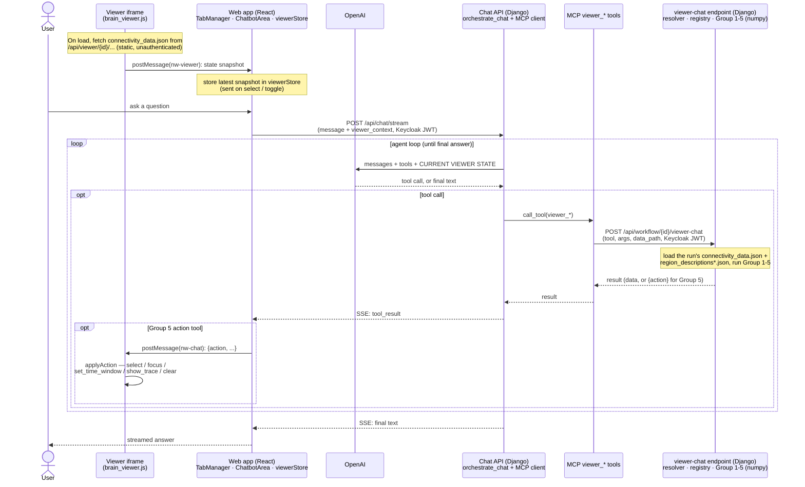

# Brain Viewer + LLM Chat

An interactive 3D brain viewer with an attached **LLM chat assistant** for
understanding the state of a simulated brain. The viewer renders a connectome's
structure and activity; the chat finds brain areas from natural language,
explains their activity curves with neuroscience metrics, and **drives the 3D
scene live** (highlight, focus, set the time window, show a trace).

The viewer itself is produced by the `TVBBrainViewerNode`
(see [Repository layout](#repository-layout)). This document focuses on the
viewer as consumed in the **web app** and its **chat** feature.

---

## How it works

Key points:

- **The chat reuses the existing browser chat** (OpenAI + Function Calling + MCP,
  authenticated with the user's Keycloak token). The viewer tools are ordinary
  MCP tools, so the chat agent sees them automatically (unless the selected
  Chat Profile restricts tools — see `docs/CHAT_PROFILES.md`).
- **Compute lives in Django** (numpy is available there; the MCP server is a thin
  HTTP proxy). The `viewer_*` MCP tools forward to an authenticated Django
  endpoint that loads the run's data and runs the vendored functions.
- **Live 3D control** is a two-way `postMessage` bridge between the chat (parent
  window) and the viewer (iframe), both on the same origin:
  - chat → viewer: a Group 5 tool returns an `{action: …}` dict; the chat forwards
    it to the active viewer iframe, which applies it to the running scene.
  - viewer → chat: when the user selects a region or changes a toggle, the viewer
    posts a state snapshot to the app, which attaches it to the next chat message
    as `viewer_context` (so the assistant knows what the user is currently seeing).

---

## Using the chat

1. Run a workflow ending in a brain-viewer node (`TVBBrainViewerNode`) so it
   writes `results/viewer/connectivity_data.json` (marmoset) or `human_data.json`
   (human) into the project.
2. Open the viewer with the **eye button** on the node — it opens as an in-app tab.
3. Open the **chat panel** (toggle). It overlays the viewer tab.
4. Ask questions. The assistant reads the *same* run the viewer renders.

Example prompts (against a marmoset run with a BOLD/TemporalAverage monitor):

| You ask | What happens |
|---|---|
| "What signal does this run have?" | `viewer_list_signals` → e.g. BOLD, 60 timepoints |
| "Which area handles planning and decisions?" | `viewer_search_regions` → e.g. **L_A10** (Area 10) |
| "Explain the activity of L_A10." | `viewer_explain_activity` → mean, trend, variability, rhythm + meaning |
| "What is L_A10 most strongly connected to?" | `viewer_get_connections` |
| "Highlight the face-recognition area." | `viewer_search_regions` → `viewer_highlight_region` → the sphere lights up **in 3D** |
| "Focus on L_A10." | `viewer_focus_region` → select + dim others + camera moves to it |
| "Set the time window to 10–20 s." | `viewer_set_time_window` → the activity scrubber jumps |
| "Clear the selection." | `viewer_clear_selection` |

You can also **click a sphere in the viewer** and then ask *"what did I just
select?"* — the assistant answers from the viewer snapshot without calling a tool.

---

## Chat tools (Group 1–5)

All tools are prefixed `viewer_`. `region` accepts an integer index **or** an exact
label like `L_A10`; for fuzzy names, call `viewer_search_regions` first.

| Group | Tool | Returns |
|---|---|---|
| 1 — semantics | `viewer_search_regions` | ranked regions for a natural-language query (index + label) |
| | `viewer_get_region` | full semantic + geometric info for one region |
| | `viewer_list_groups` | functional-group code → summary |
| 2 — structure | `viewer_get_connections` | strongest structural connections (weight, tract length) |
| | `viewer_node_strength` | incident weight + degree (hubness) |
| 3 — timeseries | `viewer_list_signals` | which signal is embedded (type, timepoints, range, units) |
| | `viewer_get_activity` | the activity curve for a region (downsampled) |
| 4 — metrics | `viewer_compute_metrics` | signal-appropriate metrics, each with definition/units/reference |
| | `viewer_explain_activity` | **headline** — region + metrics + shape summary ("explain this curve") |
| | `viewer_functional_connectivity` | Pearson r + lag between two regions |
| 5 — control | `viewer_highlight_region` | `{action: select_region}` |
| | `viewer_focus_region` | `{action: focus_region}` (select + dim + fit camera) |
| | `viewer_set_time_window` | `{action: set_time_window, t_start_ms, t_end_ms}` |
| | `viewer_show_trace` | `{action: show_trace}` |
| | `viewer_clear_selection` | `{action: clear_selection}` |

Spiking metrics (`mean_firing_rate` / `isi_cv` / `fano_factor`) exist in the
upstream library as stubs and are **not** exposed — they need spike trains, which
the current continuous-signal viewer does not produce.

---

## Data the tools read

The tools operate on the **same JSON the viewer renders** — the file the node
wrote at `results/viewer/connectivity_data.json` (marmoset) or `human_data.json`
(human):

| Key | Content |
|---|---|
| `meta` | `species`, `n_regions`, `n_connections`, ranges, stimulated regions |
| `regions[]` | `{name (e.g. "L_A10"), x, y, z, hemi, area}` |
| `connections[]` | `[i, j, weight, tract_length_mm]` (undirected, listed once) |
| `temporal_average` **or** `bold` | `{time[], data[t][region]}` — the monitor-named timeseries. Present only if the run used a monitor. **The key name is the exact signal type.** |
| `mesh`, `tracts` | cortical surface / fiber paths (rendered by the viewer, not used by the chat) |

Region **semantics** come from `region_descriptions.json` (marmoset, 106 areas)
and `region_descriptions_human.json` (human, 180 areas), shipped inside the
backend package. Each region carries `full_name`, `group`, `lobe`, a plain-language
`description`, and `keywords` — built for natural-language matching. The species is
taken from `meta.species`; when it is absent, the resolver defaults to the marmoset
lookup.

Runs **without a monitor** (`display_data="none"`) have no timeseries. Group 3/4
tools then return `{"status": "no_signal_or_bad_arg", …}` and the assistant
explains that no activity was recorded; Group 1/2/5 (semantics, structure,
highlight/focus/clear) still work.

---

## Repository layout

### Backend — compute (Django app code; **not** synced to `codes/`)

`gui/workflow_backend/django-project/app/workflow/viewer_tools/`

| File | Role |
|---|---|
| `data.py`, `regions.py`, `structure.py`, `timeseries.py`, `metrics.py`, `viewer_actions.py` | the Group 1-5 functions, vendored verbatim from the upstream `viewer_chatbot` draft (numpy-only; re-synced by diff — the only local change is a two-line provenance header) |
| `resolver.py` | `load_project_viewer_data(project, data_path)` — finds the run's JSON on disk (`existing_project_dir`), pairs it with the species' region descriptions, caches by mtime, rejects path traversal |
| `registry.py` | maps a tool name → vendored callable |
| `region_data/region_descriptions*.json` | LLM-facing region lookups (chat-only; the viewer JS never reads them) |

### Backend — endpoint & chat context

| File | Change |
|---|---|
| `app/workflow/views.py` | `ViewerChatToolView` — authenticated (`KeycloakAuthentication` + `get_accessible_project`) dispatch of `{tool, args, data_path}` |
| `app/workflow/urls.py` | route `POST /api/workflow/<id>/viewer-chat/` |
| `app/chat/serializers.py`, `app/chat/views.py`, `app/chat/services/chat_orchestrator.py` | thread `viewer_context` through and inject it as a `CURRENT VIEWER STATE` system message each agent loop |

### MCP tools

`gui/mcp_server/workflow_mcp.py` — 15 thin `viewer_*` `@mcp.tool()` wrappers that
POST to the Django endpoint (no numpy in the MCP image, so it stays a proxy).

### Viewer JavaScript (**keep the three copies byte-identical**)

`brain_viewer.js` lives in three synced locations; edit all three together:

- `src/neuroworkflow/nodes/io/viewer_static/brain_viewer.js` (canonical, ships with the node)
- `gui/workflow_backend/django-project/codes/nodes/io/viewer_static/brain_viewer.js` (backend/kernel copy)
- `gui/workflow_frontend/public/static/viewer/brain_viewer.js` (the one actually served to the iframe)

The chat bridge added to it: `applyAction` + a `message` listener (chat → 3D),
`postSnapshot` + `data_url` in `buildStateSnapshot` (3D → chat), and the exposed
`{dispose, applyAction, getSnapshot}` return.

### Frontend (React)

| File | Role |
|---|---|
| `src/components/tabs/TabManager.tsx` | viewer iframe registry, `postToActiveViewer`, snapshot `message` listener; hosts `<ChatbotArea/>` so the chat overlays every tab |
| `src/views/home/components/chatbotView.tsx` | forwards Group 5 tool results to the viewer; attaches the viewer snapshot on send |
| `src/stores/viewerStore.ts` | latest snapshot per viewer tab; derives the project-relative `data_path` from the viewer's `data_url` |
| `src/api/chatApi.ts` | `viewer_context` field on the chat request |

### Tests

`gui/workflow_backend/django-project/tests/test_viewer_tools.py` — vendored
functions on synthetic data, resolver discovery / traversal / cache-buster
stripping, and the authenticated endpoint (owner OK, non-owner 403/404, graceful
no-signal). Run in the backend container: `poetry run pytest tests/test_viewer_tools.py`.

---

## Extending

To add a tool:

1. Add the function to the relevant `viewer_tools/*.py` module (or a new one).
2. Register it in `viewer_tools/registry.py` (`name → callable`).
3. Add a thin wrapper in `gui/mcp_server/workflow_mcp.py` (`viewer_<name>`), POSTing
   `{tool, args, data_path}` to `/api/workflow/<id>/viewer-chat/`.
4. For a **viewer action** (Group 5): return an `{action: …}` dict, add the tool
   name to `VIEWER_ACTION_TOOLS` in `chatbotView.tsx`, and handle the action in
   `applyAction()` in `brain_viewer.js` (all three copies).

---

## Troubleshooting

| Symptom | Cause / fix |
|---|---|
| `{"status": "no_viewer_data", …}` | No `connectivity_data.json` / `human_data.json` under the project's `results/viewer/`, or a wrong `data_path`. Run the viewer node; verify the file with a direct `curl` to `/api/workflow/<id>/viewer-chat/`. |
| Tools never fire | `OPENAI_API_KEY` not set, or the MCP server is down (backend logs: "Failed to get MCP tools"). Also check the Chat Profile selected in the chat header — a profile with no or limited tools hides them (see `docs/CHAT_PROFILES.md`). |
| Explanation works but the 3D scene doesn't move | The `brain_viewer.js` module is cached in the browser (it loads without a cache-buster). Close and reopen the viewer tab, or hard-reload (Cmd+Shift+R). Confirm the served file is current: `fetch('/static/viewer/brain_viewer.js').then(r=>r.text()).then(t=>console.log(t.includes('nw-viewer')))`. |
| Chat says "nothing is selected" after you clicked a sphere | The viewer's own selection panel must show the region first (confirm the click hit a sphere). If it does but the chat still doesn't know, hard-reload the viewer (stale JS module). |
| Region names don't resolve | Ask the assistant to search first, or give an exact label (`L_A10`). Human runs with `meta.species = null` will mis-map to the marmoset lookup — ensure the node writes `meta.species`. |
| Metrics missing `dominant_frequency` | Expected for BOLD runs — that metric is TemporalAverage-only. |

---

## Security notes

- The viewer's data file is served by the **unauthenticated** `/api/viewer/` route
  so the iframe (which carries no bearer token) can fetch it. **Compute is
  separate and authenticated**: `/api/workflow/<id>/viewer-chat/` requires the
  user's Keycloak JWT and is project-scoped via `get_accessible_project`. Never
  move compute onto the unauthenticated route.
- `data_path` is resolved under the project directory with traversal rejection,
  and any `?…`/`#…` suffix (the viewer's cache-buster) is stripped before the
  filesystem lookup.
- Both `postMessage` directions validate the origin (`window.location.origin`) and
  a `source` tag (`nw-chat` / `nw-viewer`).
